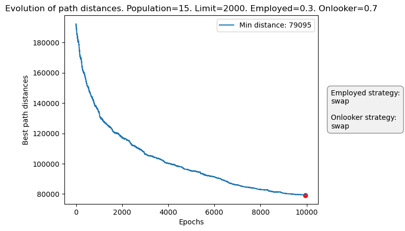
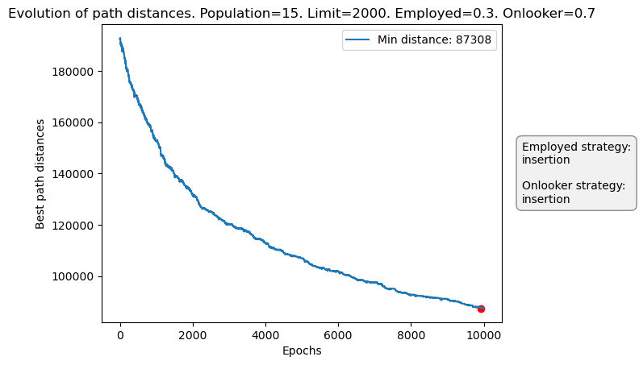
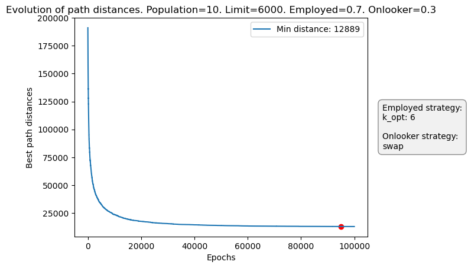
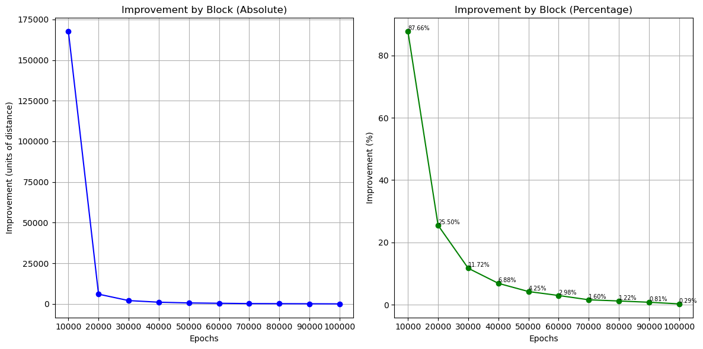
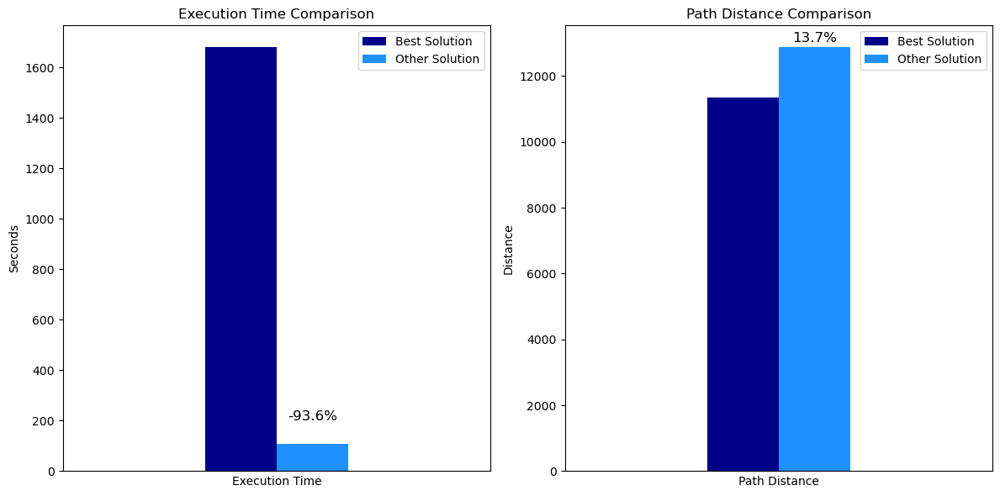

<h1 align="center"> ABC for TSP </h1>

<p align="center"> 
  
</p>

<h3 align="center"> Real case of Artificial Bee Colony in a Travel Salesman Problem, a comparative study of different techniques for the generation of new solutions</h3>


## :book: Table of Contents

<details open="open">
  <summary>Table of Contents</summary>

1. [➤ About The Project](#about-the-project)
2. [➤ Prerequisites](#prerequisites)
3. [➤ Installation](#installation)
4. [➤ Folder Structure](#folder-structure)
5. [➤ Dataset](#dataset)
6. [➤ Test Environment](#test-environment)
7. [➤ Results and Discussion](#results-and-discussion)
8. [➤ References](#references)

</details>


## :memo: About The Project <a id="about-the-project"></a>

## :wrench: Prerequisites <a id="prerequisites"></a>

The following open source packages are used to develop this project:
* numpy
* matplotlib
* pandas
* scipy
* tqdm
* joblib
* numba


Furthermore, the environment utilized for the development of the ABC algorithm for the TSP can be used directly for your purposes.

The anaconda environment can be created as follows:

    conda env create -f ABC_for_TSP.yml

## :gear: Installation <a id="installation"></a>

Once all the prerequisites packages have been installed, the package for the algorithm Artificial Bee Colony can be installed for use in solving the Travel Salesman Problem.

All the information about the package and it´s dependeces can be found in the following [link](https://pypi.org/project/abc-tsp/) from PyPI.

    pip install abc-tsp


## :file_folder: Folder Structure <a id="folder-structure"></a>

    ABC-ALGORITHM-FOR-TSP
    ├── ABC_algorithm_TSP.ipynb
    ├── ABC_for_TSP.yml
    ├── LICENSE
    ├── README.md
    │   
    ├── ArtificialBeeColony_TSP
    |   ├── abc_tsp
    |   |   ├── ArtificialBeeColony_TSP.py
    |   |   └── __init__.py
    |   ├── README.md
    |   ├── LICENSE
    |   └── setup.py
    │   
    │   
    ├── data
    │   └── lu980.tsp
    │   
    ├── images
    │   ├── presentation
    │   │   └── ABC_logo.jpg
    │   └── project_analysis
    │       ├── limit_correction.png
    │       ├── Limit_correction_comparison.png
    │       ├── normal_training.png
    │       └── normal_training_comparison.png


## :books: Dataset <a id="dataset"></a>

The data that we are going to use in this proyect will be obtein from a web call [National TSP](https://www.math.uwaterloo.ca/tsp/world/countries.html) from the University of Waterloo.

This website was created to collect large-scale data on the Travel Seller Problem from different countries. In each country you can find a different number of cities which are represented with their X and Y coordinates. The **cost of traveling between cities is specified by the Euclidean distance** rounded to the nearest whole number.

<br>

In this case we are going to work with the dataset of the country [Luxembourg](https://www.math.uwaterloo.ca/tsp/world/lu980.tsp), which conteins 980 cities but there are some cities duplicated, following the removal of the duplicate cities, a total of 634 remain.

The following example illustrates the structure of the dataset:

```
      Coord X	 Coord Y
1	49525.5556	5940.5556
2	49525.5556	5940.5556
3	49738.8889	6345.0000
4	49608.3333	6405.8333
5	49796.6667	6155.5556
...	  ...	       ...
```

<br>

The website provides information on the optimal solution, among other things:
* **Optimal value (min path distance):** 11340
* **Algorithm:** concorde (default settings), QSopt LP solver
* **Time:** 1681.68 seconds, AMD Athlon 1.33 GHz


## :computer: Test Environment <a id="test-environment"></a>

The testing and algorithm development were conducted in a controlled environment with the following hardware and software configuration:

* Processor (CPU): Intel Core i9-12900K up to 5.2 GHz Max Turbo (16 cores, 24 threads)
* Memory (RAM): 32 GB DDR5 at 5600 MHz
* Graphics Card (GPU): NVIDIA GeForce RTX 3080 Ti with 12 GB VRAM
* Operating System: Ubuntu 24.04 (64-bit)
* Python Version: 3.12.5
* Key Libraries and Dependencies:

  * numpy 2.0.1
  * matplotlib 3.9.1
  * pandas 2.2.2
  * tqdm 4.66.5
  * scipy 1.14.0
  * joblib 1.5.1
  * numba 0.61.2

Benchmark results and time analyses are included in the Results section of this repository.


## :mag_right: Results and Discussion <a id="results-and-discussion"></a>

<p align="center">
  
  
  
</p>

Has we can see with the following configuration of the hyperparams of the ABC model, the best mutation operator is the k-opt in this case the 3-opt.

Even though the k-opt operator can be the best operator for this specific dataset we provided yoy a function to found the best hyperparams, call grid_search_abc() which performs a GridSearch of all the values specified.

After executing the GridSearch with the following hyperparams:
```
param_grid = {
  "population": [10, 15, 25],
  "employed_percentage": [0.7, 0.8],
  "limit": [2000, 3000, 5000, 6000],
  "epochs": [20000, 60000, 80000, 100000],
  "employed_mutation_strategy": ['swap', 'insertion', 'k_opt'],
  "onlooker_mutation_strategy": ['swap', 'insertion', 'k_opt'],
  "k_employed": [4, 6],
  "k_onlooker": [4, 6],
}
```

The best hyperparams are:
* population: 10
* employed_percentage: 0.7
* limit: 6000
* epochs: 100000
* employed_mutation_strategy: 'k-opt'
* k_employed: 6
* onlooker_mutation_strategy: swap

Now we can perform and study of this model in comparison with the optimal solution and results of that conficguration.

<p align="center">
  
</p>


There is no need to increase the number of training epochs to try to improve the model, since we found that the minimum is already reached before reaching the established epoch limit.


In the following image, we can see how performance evolves over training time. On the left, we see the improved distance per 10,000 epochs, and on the right, we see the same result but as a percentage. We can see that after 40,000 or 50,000 epochs, performance stagnates and converges to a minimum:

<p align="center">
  
</p>


Now it is useful to compare the execution time and distance of the best path found with respect to the optimal solution provided (found with the Concorde algorithm).

We verify that the ABC algorithm finds a solution in 93.6% less time, bearing in mind that this is achieved by having previously found the best combination of hyperparameters.  

At the same time, the solution found by the ABC algorithm is 13.7% worse than the optimal one. 

<p align="center">
  
</p>


## :link: References <a id="references"></a>

Wang, Y., Jiao, J., Liu, J., & Xiao, R. (2022). A labor division artificial bee colony algorithm based on behavioral development. Information Sciences, 606, 152–172. https://doi.org/https://doi.org/10.1016/j.ins.2022.05.065

Karaboğa, D. (2005). An idea based on honey bee swarm for numerical optimization. Technical Report-TR06, Erciyes University, Engineering Faculty, Computer Engineering Department.